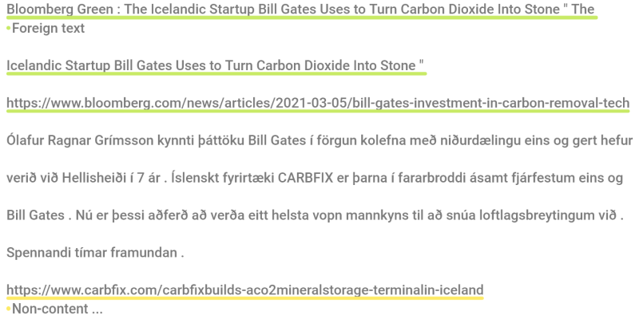

# TQ-IS: An Icelandic Text Quality Dataset

## Overview
TQ-IS is an Icelandic text quality dataset consisting of 2,000 documents sampled from three different
web-crawled corpora. Each document has been manually annotated for text quality at both the span and
document levels. Within each document, low-quality text segments are identified and labeled with one of 13
different low-quality categories. Additionally, each document is assigned an overall label of low or high quality.
The dataset includes 1,000 examples of each category.

The primary goal of TQ-IS is to facilitate the evaluation and comparison of different text quality filtering techniques. The dataset is described in the paper
[Text Filtering Classifiers for Medium-Resource Languages](https://aclanthology.org/2024.lrec-main.1372/).



TQ-IS was annotated using [doccano](https://github.com/doccano/doccano), an open-source text annotation tool.

## Structure
The TQ-IS dataset is distributed in JSONL format, with each line containing a single JSON dictionary representing a
document. Each dictionary includes the following keys:

- `text`: The content of the document.
- `spans`: A list of spans, each represented as a list with three elements: the start character index, the end character index and the category of the span.
- `label`: An binary label indicating whether the document is low-quality (0) or high-quality (1).

Here is an example dictionary for a low-quality document in the TQ-IS dataset. Note that the document text has been
truncated for brevity:

```json
{
  "text": "Skoða leiðbeinendurí allri Skemmunni > Byrjar á 0 - 9 AÁBCDEÉFGHIÍJKLMNOÓPQRSTUÚVWXYÝZÞÆÖ [...]",
  "spans": [
    [0, 195, "Non-content text"],
    [196, 850, "Non-running text"],
    [851, 2174, "Non-content text"]
  ],
  "label": 0
}
```

## Low-Quality Categories
Each low-quality text span is labeled using one of the 13 categories described in the table below.

| **Category**                | **Description**                                                                                                                                                                                                                             |
|-----------------------------|---------------------------------------------------------------------------------------------------------------------------------------------------------------------------------------------------------------------------------------------|
| **Foreign text**            | Text where the primary language is not Icelandic.                                                                                                                                                                                           |
| **Low-quality translation** | Icelandic text that has clearly been translated from another language with subpar results.                                                                                                                                                  |
| **Non-running text**        | Icelandic text that is relevant to the main subject of the document, but isn't in the form of full, grammatically structured sentences or breaks the flow of the document (e.g., lists, bullet points, tabulated data, and image captions). |
| **OCR errors**              | Digitized Icelandic text that contains a large number of errors and flaws caused by the optical character recognition (OCR) process (e.g., misrecognized characters or text columns appearing out of order).                                |
| **Fragmented text**         | Icelandic text that lacks flow or continuity (e.g., a list of headlines from news articles or a sequence of short, truncated previews from unrelated blog posts).                                                                           |
| **Non-content text**        | Icelandic text that doesn't contribute to the main subject of the document (e.g., boilerplate text, headers, footers, metadata, and navigational elements).                                                                                 |
| **Incoherent text**         | An apparently meaningless sequence of Icelandic words.                                                                                                                                                                                      |
| **Corrupted text**          | Icelandic text that contains character encoding errors (e.g., `Reykjav??k`), HTML character entities (e.g., `&quot;`), soft hyphens, and escaped characters (e.g., `\n` and `\u266c`).                                                      |
| **Run-on text**             | Icelandic text that contains a large number of run-on sentences or words.                                                                                                                                                                   |
| **Non-standard spelling**   | Icelandic text that does not conform to modern standards of spelling or grammar.                                                                                                                                                            |
| **Non-linguistic text**     | Text with no apparent meaning (e.g., seemingly random sequences of symbols and numbers).                                                                                                                                                    |
| **Code**                    | Text that consists primarily of code, such as HTML or JavaScript.                                                                                                                                                                           |
| **Repetitive text**         | Icelandic text that has occurred elsewhere in the document (e.g., a short excerpt directly from an article which appears before the article itself).                                                                                        |


## Citation
If you use this dataset in your research, please cite our paper as follows:

```bibtex
@inproceedings{dadason-loftsson-2024-text-filtering,
    title = "Text Filtering Classifiers for Medium-Resource Languages",
    author = "Da{\dh}ason, J{\'o}n  and
      Loftsson, Hrafn",
    editor = "Calzolari, Nicoletta  and
      Kan, Min-Yen  and
      Hoste, Veronique  and
      Lenci, Alessandro  and
      Sakti, Sakriani  and
      Xue, Nianwen",
    booktitle = "Proceedings of the 2024 Joint International Conference on Computational Linguistics, Language Resources and Evaluation (LREC-COLING 2024)",
    month = may,
    year = "2024",
    address = "Torino, Italy",
    publisher = "ELRA and ICCL",
    url = "https://aclanthology.org/2024.lrec-main.1372",
    pages = "15789--15801",
}
```

## License
The TQ-IS dataset is licensed under the Creative Commons Attribution 4.0 International (CC BY 4.0) license.